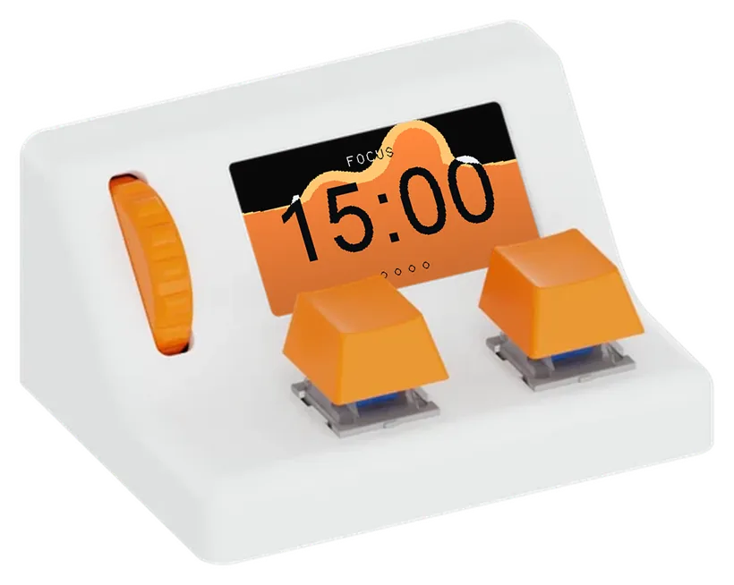
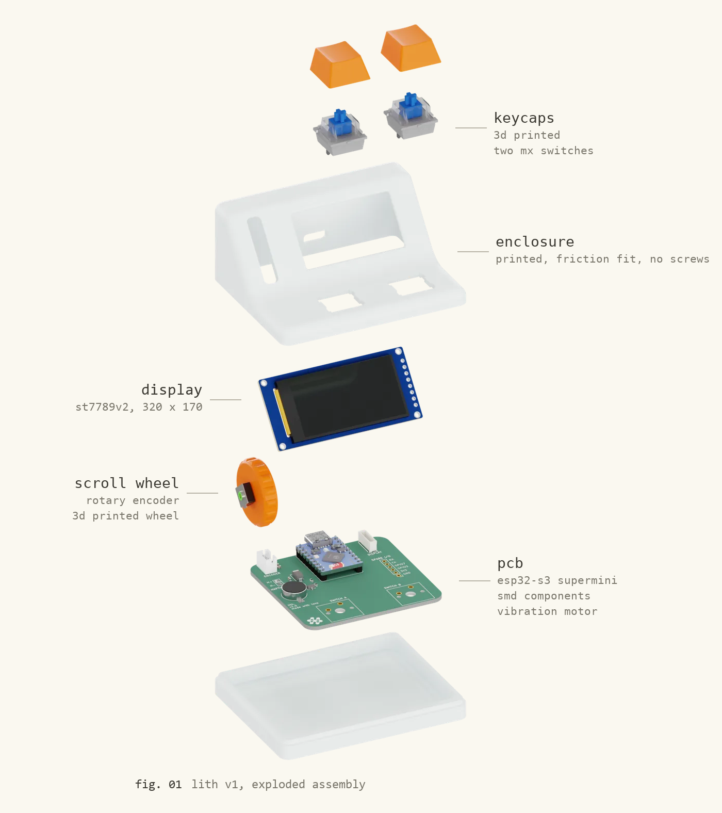

  

## the oldest tool we know how to make

In 1931 Louis Leakey began digging at Olduvai Gorge, a ravine cut through the
Serengeti plain in northern Tanzania. What he and Mary Leakey pulled out of its
walls over the following decades were stones that had been deliberately broken:
cores struck with a hammerstone until a sharp flake came away. The industry took
its name from the gorge. We call it the **Oldowan**, and the oldest examples of
it are around 2.6 million years old, older than our own species by a factor of
ten.

They are not much to look at. That is the point. A stone chopper is the simplest
thing that is unmistakably *made*, and for most of the time there have been
hominins at all, it was the most complicated thing anyone could do. Making one
is harder than it looks: you have to read the stone, find a platform, and strike
at an angle that takes a flake off rather than shattering the core. People who
try it without being shown mostly fail.

Which is the interesting part. Knapping is difficult enough to learn, and
useless enough to invent from scratch, that it had to be **taught**. A 2015
experiment by Morgan and colleagues found that transmitting Oldowan technique
got measurably better as you moved from letting people watch, to gestural
teaching, to teaching with words.[^1] Their argument is that toolmaking and
language leaned on each other as they grew. The first thing we made and the
first thing we said may have been the same conversation: *here, hold it like
this.*

So the through-line from a chopper to a circuit board is not the tools. It is
the teaching.

## what lith is

lith is a small desk object: an ESP32-S3, a 320x170 display, a scroll wheel,
two key switches and a vibration motor in a printed shell. Out of the box it is
a pomodoro timer. That is the shape it arrives in, not the shape it has to keep.

The name is from *líthos*, stone. You reconfigure it by **knapping** it: you
describe what you want it to be, an agent called Oldowan writes the firmware,
and it is flashed to the device from the browser. The tools people make get
shared in the knappery.

The reason it is built this way is Bandura's: self-efficacy, the belief that
you can actually do the thing, is built most strongly from **mastery
experience**, and after that from watching someone like you succeed.[^2] Which
role model, and for whom, turns out to matter: a systematic review by
Gladstone and Cimpian found that the effect depends on how *similar* the model
seems and how *attainable* their success looks, and that a model whose success
reads as out of reach can demotivate rather than encourage.[^3] lith is
arranged so a beginner gets all three in order. You *watch* it be made, on a
page that takes the object apart in front of you. You *make* one, by asking
for it in plain language and getting working firmware back. Then you *use* the
thing you made, on your desk, where other people can see it.

The claim is not that the agent makes anyone an embedded engineer. It is that
having the object do what you asked, on the first afternoon, is the mastery
experience that makes the second attempt likely.

## what is in here

| | |
|---|---|
| [`firmware/`](firmware/) | The PlatformIO project that runs on the device. The pomodoro timer, the metaball fluid renderer, the display and input drivers. This is the stock shape lith ships in. |
| [`website/`](website/) | [lith.vidalion.co](https://lith.vidalion.co). The scroll-driven homepage and the onboarding walkthrough, every earlier version of both, and the Oldowan agent that writes firmware from a conversation. |
| [`research/`](research/) | Two studies run against the agent: whether the model tier behind Oldowan changes the quality of what it builds, and what the providers cost and how long they take. |

### website/

- `site/`: the two pages as they are served. `index.html` is the scroll-driven
  homepage, `onboarding.html` the walkthrough a new lith arrives with.
- `agent/`: Oldowan. `oldowan.py` is the conversation and prompt layer,
  `builder.py` compiles and repairs the sketch it produces, `knappery.py` is the
  sharing side. `providers.json` selects the model; keys come from a
  `secrets.json` that is not in this repo.
- `versions/`: dated snapshots of every earlier version of both pages, back
  to before the renders existed.
- `assets/`: the WebP sequences the site actually serves.

### research/

- `ui-judge/`: 19 firmware builds from 11 models across 5 providers, compiled,
  rendered on the simulator and judged. The headline is that the **repair loop
  matters more than the model tier**: first-pass compile rate was 26%, and the
  builder's own repair passes took it to 79%.
- `provider-cost-latency/`: wall-clock latency and list price across the
  providers Oldowan can run on, replayed through one real 3-turn conversation.

Both are written up with their figures in
[`research/README.md`](research/README.md).

## a note on the timer above

It is not a mock-up. The panel is drawn by compiling the firmware's own fluid
code for the PC, then perspective-warped into the display, which in that render
is a Holdout pass and so a real alpha hole. The site does the same thing at
runtime with a CSS `matrix3d` homography.

[^1]: Morgan, T.J.H. et al. (2015). Experimental evidence for the co-evolution
of hominin tool-making teaching and language. *Nature Communications* 6:6029.

[^2]: Bandura, A. (1997). *Self-Efficacy: The Exercise of Control*. W.H. Freeman.

[^3]: Gladstone, J. R., & Cimpian, A. (2021). Which role models are effective
for which students? A systematic review and four recommendations for maximizing
the effectiveness of role models in STEM. *International Journal of STEM
Education*, 8(1), 59. https://doi.org/10.1186/s40594-021-00315-x
