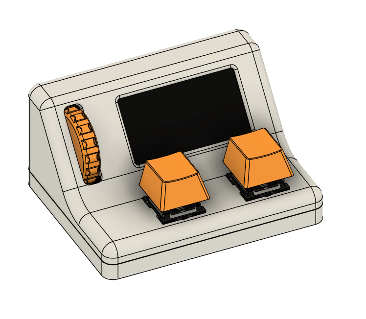
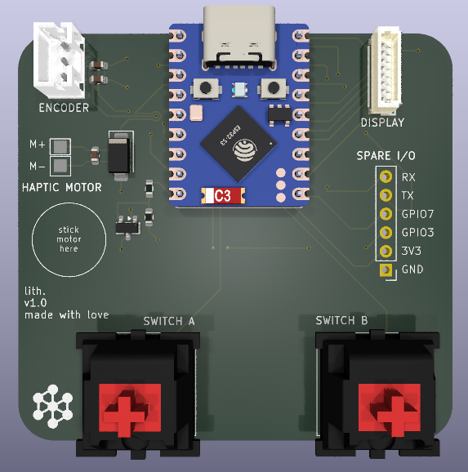

# cad

Mechanical and PCB source for lith v1.

    lith_assy_v1.step        full assembly, mechanical solids and PCB copper
    mechanical/
      lith_assy_v1.f3d       the Fusion source
      enclosure_top.stl      top shell, display cutout and switch plate
      enclosure_bottom.stl   base
      encoder_wheel.stl      scroll wheel
      keycap.stl             keycap, one per switch
    pcb/
      v1.0/                  KiCad project, first board
      v1.1/                  KiCad project, second board
        lith.kicad_sch       schematic
        lith.kicad_pcb       layout
        jlcpcb/gerber/       the fab output that was sent to JLC
        customs.pretty/      footprints drawn for this board

Each board folder is a self-contained KiCad project: it carries its own
`fp-lib-table` / `sym-lib-table` and the non-stock symbols, footprints and
connector 3D models the design pulls in, so it opens without the rest of the
library set.

