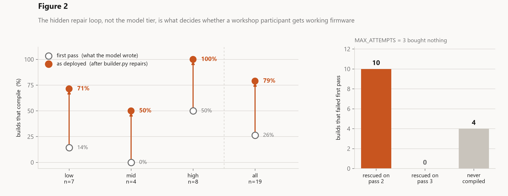
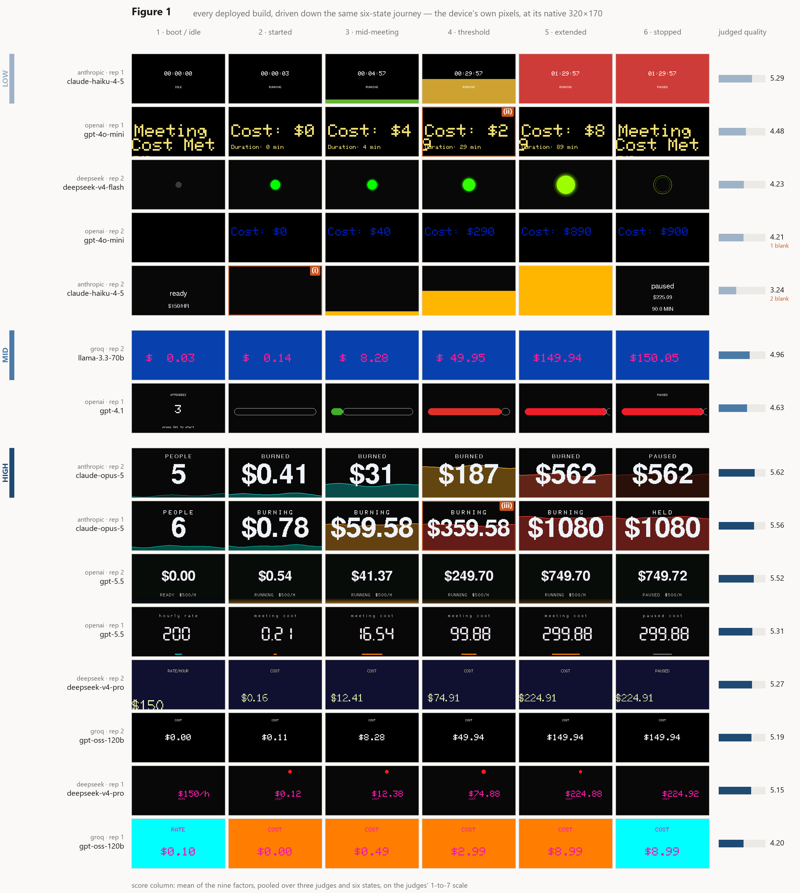
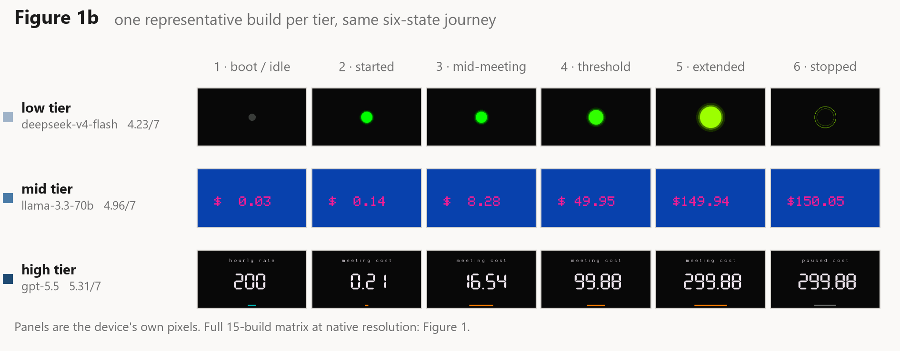
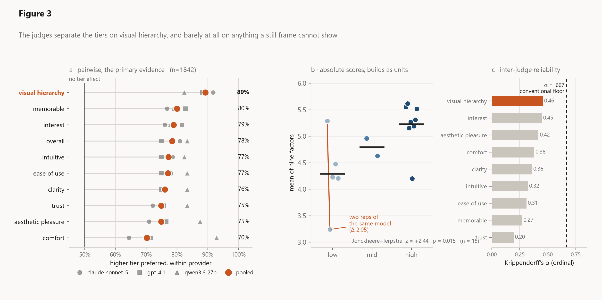
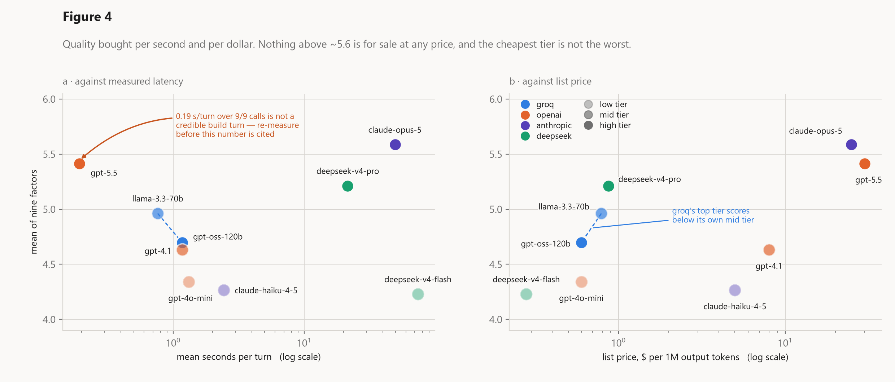
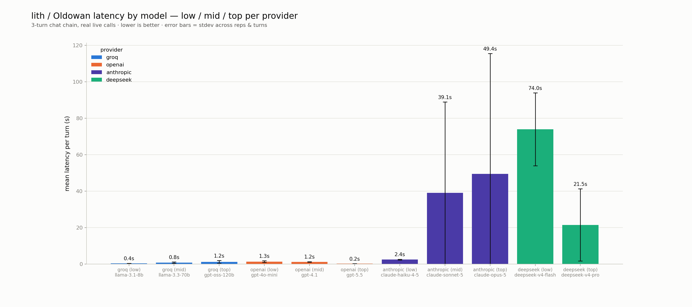
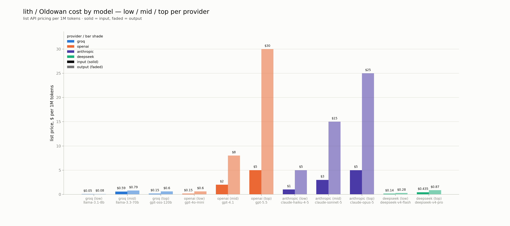

# research

Two studies, both aimed at the same question from different sides: **can a
language model be trusted to write the firmware a beginner asked for?** One
looks at the quality of what comes out, the other at what it costs to get it.

Both run against Oldowan, the co-design agent in [`../website/agent/`](../website/agent/).

---

## ui-judge

19 firmware builds, generated from one brief by 11 models across 5 providers,
compiled, rendered on a simulator that runs the sketches as the device would,
and then judged.

### the repair loop matters more than the model

This is the finding that changed how the agent is built. Straight out of the
model, only 5 of 19 builds compiled. After `builder.py`'s repair passes, 15 of
19 did.

Every rescued build was fixed on **pass 2**. `MAX_ATTEMPTS = 3` bought nothing
on this brief, which means the third attempt is cost with no return.

### tier buys hierarchy, not coverage

Every build that compiles distinguishes more or less all six states of the
journey, so journey coverage does not separate the tiers at all (p = 0.87).
What separates them is whether the screen is laid out well.

That matrix is 2735 x 3052 px, which is right for reading on screen and useless
once a word processor scales it into a column. The same journey, one
representative build per tier, sized for a 16 cm text column:

The three rows are the argument in miniature. All three compile, all three
cover the journey, and all three are honestly reporting the same running cost.
The low-tier build says it with a green dot that gets bigger. The mid-tier
build says it with a bare number. Only the high-tier build tells you what the
number *is*, puts the label above it, and gives the state its own indicator.

On the pairwise task the higher tier wins 0.90 of the time. But rep-to-rep
variance beats the tier effect: two `claude-haiku-4-5` runs of the same prompt
differ by 2.05 on the nine-factor mean, where the whole low-to-high tier gap is
0.94.

Inter-judge agreement is weak (Krippendorff's alpha 0.35), so the absolute
Likert scores are descriptive only. The pairwise comparison is what carries the
argument.

### where the instrument comes from

The nine factors are not invented here. They are taken from Luera et al.,
*MLLM as a UI Judge* (arXiv:2510.08783), an Adobe Research benchmark that
validates multimodal LLMs as predictors of human perception of interfaces:
ease of use, clarity, visual hierarchy, memorability, trust, intuitiveness,
aesthetic pleasure, interest and comfort, checked against 9,296 human Likert
responses over thirty interfaces with GPT-4o, Claude 3.5 Sonnet and
Llama-3.2-11B-Vision as the judges. Their Table 1 gives the battery, their
Figure 7 gives the prompt, and their Task 2 is the pairwise comparison used
here.

Their results are the reason this study is shaped the way it is. Their judges
land within one Likert point of the human mean 72 to 77% of the time, but get
the *exact* score right only 35 to 38% of the time. So absolute scores are
soft and comparisons are firm, and the design follows: score everything, but
argue from the pairwise task.

That paper is itself the UI-specific descendant of a now-standard method.
LLM-as-a-judge was established by Zheng et al., *Judging LLM-as-a-Judge with
MT-Bench and Chatbot Arena* (NeurIPS 2023 Datasets and Benchmarks,
arXiv:2306.05685), which showed a strong model scoring open-ended text could
reach roughly the 80% agreement with human preference that humans reach with
each other, and which named the failure modes that come with it: position
bias, verbosity bias, and self-enhancement bias, the tendency of a judge to
prefer its own output.

Those three biases are why this run is built the way it is. Every pairwise
comparison is shown in **both A/B orderings**, so a judge that flips when the
options are swapped is recorded as having no preference rather than being
silently resolved in whichever direction it happened to be asked. The judges
are drawn from **three different model families** (`claude-sonnet-5`,
`gpt-4.1`, `qwen3.6-27b`) precisely so that self-enhancement cannot quietly
decide the ranking, since a judge scoring builds from its own family is the
obvious hazard when the thing being judged is model output. And each frame is
scored three times with the median taken, to damp sampling noise.

**One honest correction to how this study describes its own source.** The
protocol justified treating pairwise as primary by citing Luera et al.'s
"roughly 90%" pairwise agreement. That figure applies only to the subset of
comparisons where two interfaces were separated by a large human score gap.
Their *overall* pairwise accuracy against human preference is 52.96 to 59.98%
(Claude 59.98%, GPT-4o 59.60%). The design choice still stands, and this run's
own alpha of 0.35 independently says the absolute scores cannot carry the
argument. But the pairwise result here should be read against a 53 to 60%
baseline, not against 90%.

**The chain of borrowed validation gets thinner at every link.** Zheng et al.
validated judges on text. Luera et al. carried the method across the modality
gap to rendered, full-size, professionally designed web screens. This study
carries it one gap further, onto a 320x170 embedded panel showing six frames
of a timer. No human ratings of *these* screens were collected. What is
established here is how MLLM judges rank the output of different provider
tiers. That lith's actual users would rank them the same way is assumed, not
shown.

### where to look

| | |
|---|---|
| [`RESULTS.md`](ui-judge/RESULTS.md) | The full write-up of the run. |
| [`SECTION_codesign_agent.md`](ui-judge/SECTION_codesign_agent.md) | The ~1,800-word report section this became. |
| [`DEVIATIONS.md`](ui-judge/DEVIATIONS.md) | Where the run departed from the written protocol. |
| [`results/`](ui-judge/results/) | Every CSV and raw judge response. |
| [`code/`, `code_deployed/`](ui-judge/code/) | The sketches as generated, and as they ended up after repair. |
| [`harness/`](ui-judge/harness/) | The gates, the judges, the simulator and `make_figures.py`. |

Run 2026-08-16; written up 2026-08-20.

---

## provider-cost-latency

Wall-clock latency and list price across every provider Oldowan can be pointed
at, replayed through one real 3-turn conversation taken verbatim from a session
rather than a synthetic prompt.

Groq is the latency floor by a wide margin, which is the inference hardware
rather than a small-model effect. The reasoning-heavier models are both slower
and far noisier, and for an agent that streams its answer to someone waiting,
the spread matters as much as the mean.

Run 2026-08-10.

### read the spreadsheet, not the prose

Three things anyone using this data needs to know first:

- **`lith_provider_latency.md` is stale against `lith_provider_latency.xlsx`.**
  The prose describes an 8-model run; the sheet, saved 37 minutes later, is an
  11-model run that disagrees hard (sonnet-5 at 39.087 s mean, not 1.78 s
  stdev). Trust the sheet.
- `bench_build.py` and `bench_latency.py` hand `oldowan._call_anthropic`'s
  return value straight to `parse_envelope`, but the anthropic path returns a
  dict where the openai path returns a bare string. The anthropic rows in the
  older CSVs are wrong because of it.
- The `gpt-5.5` figure (0.193 s mean, 0.012 s stdev) is not plausible and needs
  re-measuring before it is cited anywhere.

One more trap for anyone re-running a tier sweep: `providers.json` sets
`effort: medium`, and `claude-haiku-4-5` returns a 400 on that field. It has to
be dropped for that model specifically.

---

## what this suggests for lith

Six things follow from the two studies. They are ordered by how much they
would change if acted on.

**1. Spend on the repair loop, not on the model.** This is the largest
effect in either study by a wide margin: 26% of builds compiled on the first
pass, 79% after repair. No tier upgrade available anywhere in the price table
buys a jump of that size. If there is engineering time to spend on the agent,
it goes into `builder.py`, not into `providers.json`.

**2. Set `MAX_ATTEMPTS = 2`.** Every build that repair rescued was fixed on
pass 2. The third attempt rescued nothing on this brief while costing a full
generation round-trip on the slowest path a user can be on. Keep the third
pass only if a later brief shows it earning its place.

**3. Sample rather than upgrade.** Two runs of the same prompt on
`claude-haiku-4-5` differ by 2.05 on the nine-factor mean; the entire
low-to-high tier gap is 0.94. Variance is more than twice the signal. That
makes best-of-k on a cheap fast model a better use of the same money than one
attempt on an expensive one, and the pairwise judge is already the instrument
for picking the winner.

**4. Put hierarchy in the prompt, since that is what tier is actually
buying.** Journey coverage does not separate tiers at all (p = 0.87).
Everything that compiles shows all six states. What separates them is visual
hierarchy, and Figure 1b shows what that means concretely: one dominant
value, a label that says what the value is, and a state indicator that is not
the value itself. Those are writable rules. Encoding them in
`device_profile.json` would hand the low tier most of what the high tier is
being paid for.

**5. Treat latency as a design property, not an implementation detail.**
Groq returns in well under half a second; `claude-sonnet-5` averages 39
seconds with a 49-second standard deviation. Somebody knapping their first
lith is watching a spinner for that whole time, on the exact afternoon the
project is trying to convert into a mastery experience. A fast model for the
first build with a strong model held back for refinement fits both the
self-efficacy argument and the cost table.

**6. Buy the human validation before the claim is load-bearing.** The
instrument's alignment with human judgement is inherited from a paper about
full-size web screens. Thirty people rating a subset of these frames would
convert the weakest part of the argument into the strongest, and it is a
morning's work. Until then, phrase findings as "MLLM judges prefer" rather
than "users prefer".

One caution that cuts against acting too hard on any of this: all 19 builds
answer a single brief, the mid tier is unbalanced and missing
`claude-sonnet-5` entirely, and six still frames discard motion, which is a
large part of what a glanceable display actually does. The repair-loop finding
is robust because it is enormous. The tier findings are directional.

---

## references

1. Luera, R., et al. (2025). MLLM as a UI Judge: Benchmarking Multimodal LLMs
   for Predicting Human Perception of User Interfaces. arXiv:2510.08783.
   https://arxiv.org/abs/2510.08783

2. Zheng, L., Chiang, W.-L., Sheng, Y., et al. (2023). Judging LLM-as-a-Judge
   with MT-Bench and Chatbot Arena. *Advances in Neural Information Processing
   Systems 36, Datasets and Benchmarks Track*. arXiv:2306.05685.
   https://arxiv.org/abs/2306.05685
